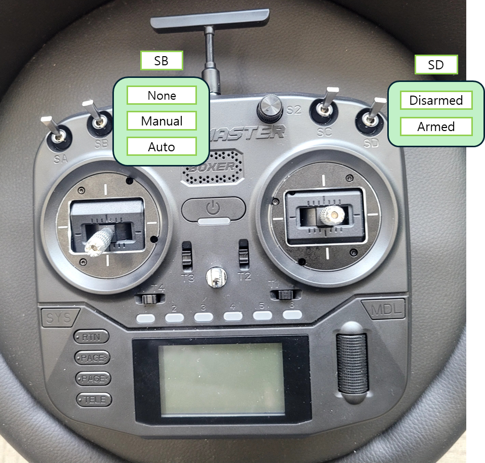
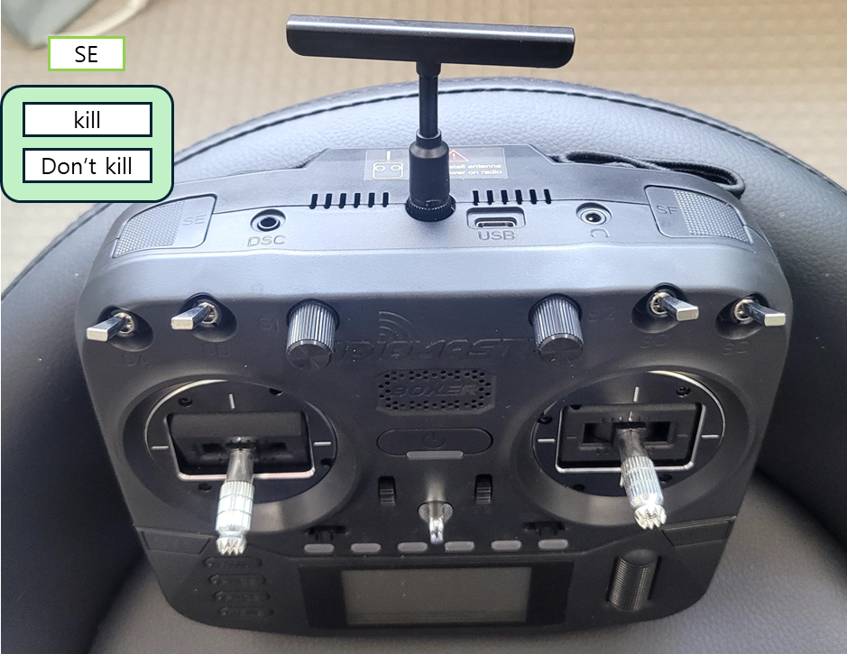

# drone_control_pkgs

## Installation

```
cd ~/rotor_sim_ws/
```
Install drone_control pacakge
```
colcon build --packages-select drone_control --symlink-install
```

Install drone_dob package
```
colcon build --packages-select drone_dob --symlink-install
```


## Run Launch

Go to the following link and then install the pacagkes.

https://github.com/kay01-kwon/ros2_device_bringup

After install the pacakge, run the node with px6x mini.

Terminal 1

Navigate to the workspace.
```
cd ~/device_ws 
```
Source setup.bash.
```
source install/setup.bash
```
Run the px4 node.
```
ros2 launch px4_launch px4.launch
```
Terminal 2
```
cd ~/device_ws
```

```
source install/setup.bash
```

```
ros2 run px4_launch px4_client_node
```

Terminal3
```
cd ~/rotor_sim_ws
```

```
source install/setup.bash
```

```
ros2 launch drone_dob hgdo.launch.py
```


Terminal 4
```
cd ~/rotor_sim_ws
```

```
source install/setup.bash
```

```
ros2 launch drone_control rc_control.launch.py
```

## How to activate manual stab mode

1. SE: Deactivate Kill switch by pressing the button.

2. SD: Switch from Disamed to armed state.

3. SB: Stick to Neutral position.

4. To move up, increase throttle.





## To do list

1. DOB Implementation

- [x] HGDO

- [x] L1 adaptation

- [ ] Recursive Least Sqaure Method (Coefficient)

- [ ] UKF/EKF for DOB

2. Control Implementation

- [x] Manual control (Velocity control mode for emergency)

- [x] Simple NMPC

- [x] NMPC (Acados) with DOB

- [ ] NMPC (Acados + Actuator model) with DOB (RLS)

- [ ] PD controller + RLS

- [ ] NMPC/RC integration with DOB (Integration)

3. Rotor state estimator

- [x] Kalman filter with constraint inequality